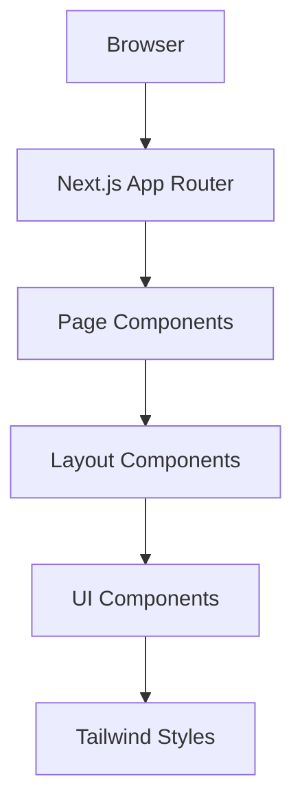

# Arquitetura do Projeto Lotego

## 📐 Visão Geral da Arquitetura

O **Lotego** segue uma arquitetura moderna baseada no Next.js 15 com App Router, priorizando simplicidade, performance e manutenibilidade.

## 🏗️ Camadas da Aplicação

### 1. Apresentação (Frontend)
- **Framework**: Next.js 15.3.4 com App Router
- **UI Library**: React 19.0.0
- **Estilização**: Tailwind CSS v4
- **Tipagem**: TypeScript 5+

### 2. Roteamento
- **Sistema**: App Router do Next.js
- **Estrutura**: File-based routing em `src/app/`
- **Layouts**: Layouts aninhados suportados
- **Metadata**: Geração automática de SEO

### 3. Assets e Recursos
- **Imagens**: Next.js Image Optimization
- **Fontes**: Google Fonts (Geist Sans/Mono)
- **Assets Estáticos**: Servidos via `/public`

## 🔄 Fluxo de Dados



## 📁 Organização de Componentes

### Estrutura Proposta
```
src/
├── app/                    # App Router pages
│   ├── (routes)/          # Route groups
│   ├── components/        # Page-specific components
│   ├── layout.tsx         # Root layout
│   └── page.tsx          # Home page
├── components/            # Shared components
│   ├── ui/               # Base UI components
│   ├── forms/            # Form components
│   └── layout/           # Layout components
├── lib/                  # Utilities and configurations
├── hooks/                # Custom React hooks
├── types/                # TypeScript type definitions
└── styles/               # Global styles
```

## 🎨 Sistema de Design

### Princípios
- **Mobile-first**: Design responsivo por padrão
- **Acessibilidade**: WCAG 2.1 AA compliance
- **Consistência**: Componentes reutilizáveis
- **Performance**: Otimização de bundle

### Tailwind CSS v4
- Configuração moderna com CSS nativo
- Variáveis CSS para temas
- Dark mode automático
- Responsive design system

## 🔧 Configurações Técnicas

### Build e Bundling
- **Bundler**: Turbopack (desenvolvimento)
- **Compiler**: SWC (produção)
- **Output**: Static/SSR híbrido
- **Optimization**: Automatic code splitting

### TypeScript
- **Modo**: Strict
- **Target**: ES2022
- **Module**: ESNext
- **JSX**: preserve

## 🚀 Estratégia de Deploy

### Ambientes
- **Desenvolvimento**: Local com Turbopack
- **Staging**: Vercel Preview
- **Produção**: Vercel Production

### Otimizações
- Image optimization automática
- Font optimization
- Bundle splitting
- Static generation quando possível

## 🔒 Considerações de Segurança

### Frontend Security
- CSP headers configurados
- XSS protection via React
- Sanitização de inputs
- Secure headers no Next.js

### Performance
- Core Web Vitals otimizados
- Lazy loading de componentes
- Prefetch inteligente
- Caching estratégico

## 📊 Monitoramento

### Métricas Planejadas
- Core Web Vitals
- Bundle size tracking
- Error monitoring
- User analytics

## 🔄 Padrões de Desenvolvimento

### Componentes
- Functional components only
- Custom hooks para lógica compartilhada
- Props interface bem definidas
- Composition over inheritance

### Estado
- React state para UI local
- Context API para estado global leve
- Server state via fetch/SWR quando necessário

### Estilização
- Utility-first com Tailwind
- Component variants pattern
- Responsive design mobile-first
- Dark mode support

## 🎯 Princípios Arquiteturais

1. **Simplicidade**: Evitar over-engineering
2. **Performance**: Otimização contínua
3. **Manutenibilidade**: Código limpo e documentado
4. **Escalabilidade**: Estrutura que cresce com o projeto
5. **Acessibilidade**: Inclusão por design 